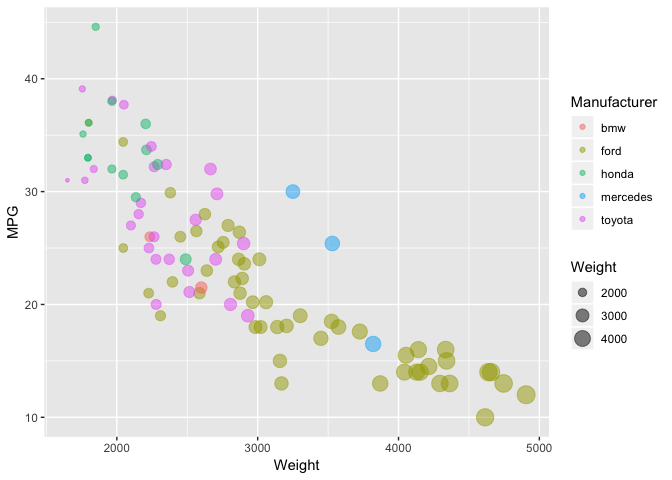

DataVis-10ways-1st
================

GitHub Documents
----------------

This is an R Markdown format used for publishing markdown documents to GitHub. When you click the **Knit** button all R code chunks are run and a markdown file (.md) suitable for publishing to GitHub is generated.

Read car-sample.csv file
------------------------

``` r
CarData<-read.csv(file = "/Users/HYT/Desktop/CS573 Data Visualization/git/02-DataVis-10ways/cars-sample.csv",  header=TRUE, sep=",")
summary(CarData)
```

    ##        X                Car       Manufacturer      MPG       
    ##  Min.   :  5   pinto      : 6   bmw     : 2    Min.   :10.00  
    ##  1st Qu.:108   corolla    : 5   ford    :53    1st Qu.:18.00  
    ##  Median :213   maverick   : 5   honda   :13    Median :24.00  
    ##  Mean   :210   corona     : 4   mercedes: 3    Mean   :24.16  
    ##  3rd Qu.:322   civic      : 3   toyota  :26    3rd Qu.:29.95  
    ##  Max.   :405   galaxie 500: 3                  Max.   :44.60  
    ##                (Other)    :71                  NA's   :2      
    ##    Cylinders      Displacement     Horsepower         Weight    
    ##  Min.   :4.000   Min.   : 71.0   Min.   : 52.00   Min.   :1649  
    ##  1st Qu.:4.000   1st Qu.:107.0   1st Qu.: 75.00   1st Qu.:2228  
    ##  Median :4.000   Median :140.0   Median : 88.00   Median :2702  
    ##  Mean   :5.268   Mean   :180.3   Mean   : 98.21   Mean   :2861  
    ##  3rd Qu.:6.000   3rd Qu.:250.0   3rd Qu.:119.00   3rd Qu.:3302  
    ##  Max.   :8.000   Max.   :429.0   Max.   :215.00   Max.   :4906  
    ##                                  NA's   :3                      
    ##   Acceleration     Model.Year         Origin  
    ##  Min.   : 8.00   Min.   :70.00   American:53  
    ##  1st Qu.:14.00   1st Qu.:73.00   European: 5  
    ##  Median :15.60   Median :76.00   Japanese:39  
    ##  Mean   :15.59   Mean   :76.11                
    ##  3rd Qu.:17.00   3rd Qu.:80.00                
    ##  Max.   :21.80   Max.   :82.00                
    ## 

Including Plots
---------------

    ## Warning: Removed 2 rows containing missing values (geom_point).



Note that the `echo = FALSE` parameter was added to the code chunk to prevent printing of the R code that generated the plot.
