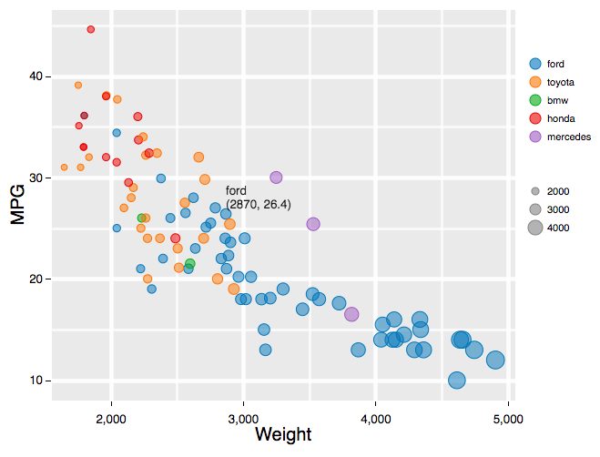
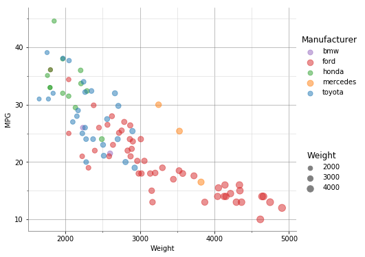
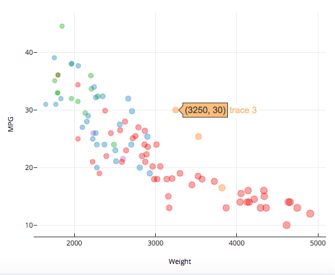
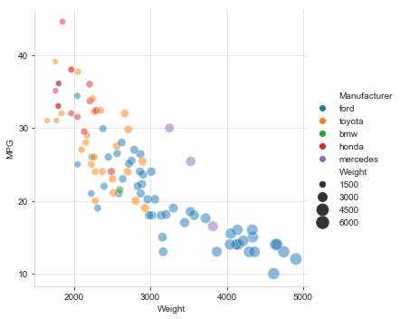
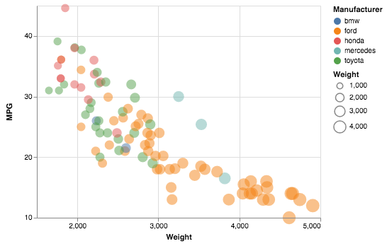
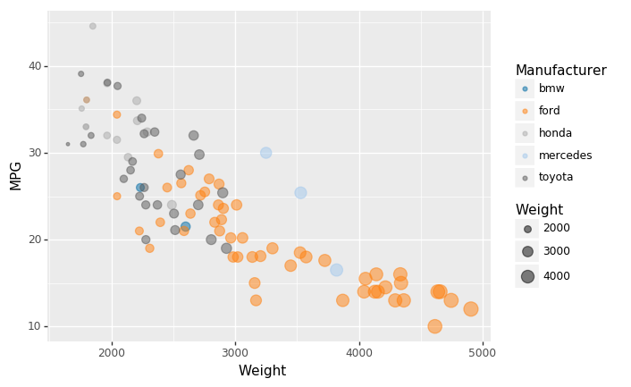
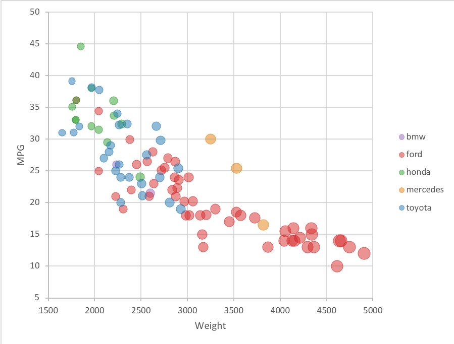
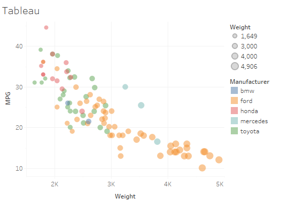
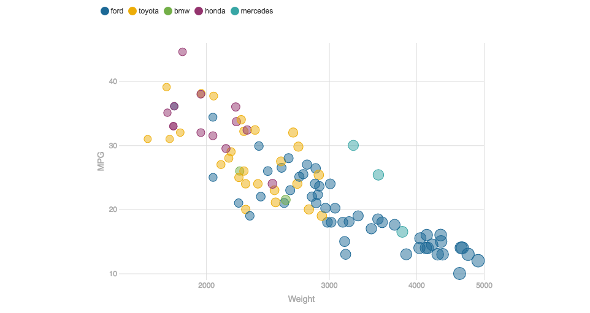
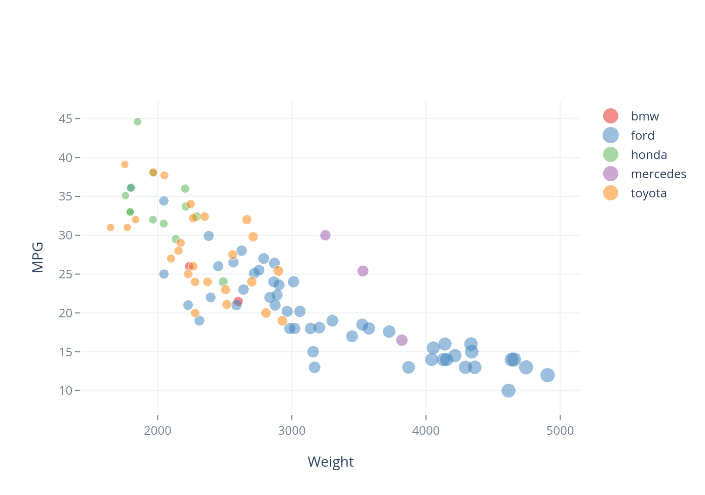

Data Visualization, 10 Ways  
===

# 1. R + ggplot2 + R Markdown

R is a language primarily focused on statistical computing.
ggplot2 is a popular library for charting in R.
R Markdown is a document format that compiles to HTML or PDF and allows you to include the output of R code directly in the document.

To visualized the cars dataset, I made use of ggplot2's `geom_point()` layer, with aesthetics functions for the color and size.

R+ggplot2 is the easiest way among these 10 methods since only one line code is enough.

However, the default color setting is good but not perfect.

# 2. d3
d3 is a useful data visualization javascript library.
It is the most flexible tool since you can draw anything anywhere as long as you know how to write the code.
High flexibility enables us to design freely. However, just like drawing on a canvas, you need to draw the line, the circle and the grid,  set the color, the size and the position all one by one, which inevitablely brings inconvenience.
All in all, d3 is an excellent tool since you can draw anything without limitation on a canvas level rather than plotting and interactions are easy to achieved.

Before I visualized the car dataset, I cleared the NA value by `.filter` function and transformed the string type to int type. 
`d3.axis` helps a lot when drawing ticks and grids. 

d3 also provides a beautiful color library and d3.schemeCategory10 is used in this case.

What's more is that hover effect is achieved as an interactive design, which conveys an accurate value on each point.

Below is the link and screenshot of d3. 

https://yutinghan.github.io/d3-bubble-plot/index.html

# 3. Python + Matplotlib + jupyter
Python is a language widely used and prefered by data scientists.
Jupyter notebook is a document format allowing you to include the output of python code directly in the document.
Matplotlib is a flexible library with a comprehensive list of features. Functions like major and minor ticks, grid, and set_visible enable users to plot like drawing on a canvas.

There are two insufficient features. The first one is that it is not easy to align symbols when there are several legends. The other one is that it does not provide interactive function. Fortunately, it could be made up by the library plottly by one-line code. The effect is on URL https://plot.ly/~YutingHan/14/mpg-vs-weight/#/. 

However, the legend of the interactive plot is not perfect since it is transformed from one library to another.

# 4. Python + Seaborn + jupyter

Seaborn is an extended library of Matplotlib where the coding is less complicated and the default color is more aesthetic.

Functionality is limited if only using Seaborn however coding is not simple if only using Matplotlib.

I recommend using Seaborn first to perform basic framework, which is packaged by Seaborn and could be coded in 1 or 2 lines.
Then matlibplot is applied to add details and can perfect the chart created by Seaborn.

What's more is that the default layout of legend in Seaborn is not well arranged in line space.

# 5. Python + Altair + jupyter
Altair is a staistical visualization library for python. It provides the best user experience among all plotting libraries in python that  I have used since the coding could not be simpler.

Just assign values to x, y, color and size, the bubble plot will be produced. 

The layout of legends are more appropriate than in Seaborn.

# 6. Python + Plotnine + ggplot + jupyter + Tableau's "Color Blind10"
Plotnine is an implementation of a grammar of graphics in python and ggplot is a function in it used for plotting.
Tableau's "Color Blind10" is a color blind-friendly color scheme.

Plotnine's ggplot function is as easy to use as ggplot2 in R and the default layout is the same. The default color scheme is replaced by Tableau's "Color Blind10".

# 7. Excel + bubble plotting
Excel is a dedicated tool which produces plot without coding. Bubble plotting is an pre-existing template for weighted scatter plots. Most of plot functions and color settings can be found in Excel. 

However, there are two drawbacks. 

The first one is the categorical data setting. Even though the number of categories is not large, it is quite annoying to add categories one by one. 

The second one is Excel's limited flexibility since Excel provides a template rather than a canvas. For example, the first number shown on the axis must correspond to the start point on the axis. 

What's more is that excel's color setting is less aesthetic so I changed it to Tableau's color.

In conclusion, the more functions it provides, the more difficult the plotting is. Excel is not a convenient plotting tool if you are not familiar with it since plotting is only a small part of its functions.

# 8. Tableau
Tableau is a dedicated tool focusing on plotting. It is easier than excel since plotting is its main job.

Plotting functions are limited compared to d3 but each one is quite useful.

For example, you can set tick origin and tick interval easily which could not be achieved by excel.

What's more is that the color setting in Tableau is perfect and I also used the Tableau's color board in other ways, i.e. matlibplot and excel.

# 9. Flourish
Flourish is a dedicated tool focused on plotting. It is easier than tableau since it only provides plotting functions with no aggregations.

The design style follows "less is more" and the default color is perfect.

I have to say when a plotting tool is quite easy to handle, it loses some flexibility since the framework and pattern is produced automatically and can not be changed. As a result, weight legend can not be added and the position of color legend cannot be changed.

However, I still like Flourish so much because it's quite simple and friendly for a beginner. If there wasn't as much constraint on the plot, which could not be achieved by flourish, it would be my first choice.

# 10. Plotly
Plotly is a dedicated online tool focused on plotting. Both png files and interactive html websites can be exported.

Producing an interactive plot without coding is Plotly's biggest advantage. 

However, the data importing is inconvenient since plotly only accepts entering category data one by one. As a result, I repeat the same action 5 times.

Plotly also supports python library but it also needs to seperate data according to the categories and adds them one by one.

Below is the link and screenshot.

https://yutinghan.github.io/cs573-Assignment2_plotly/plotly.html

      

## Technical Achievements
- **Interactive effect**: Interactive effect provides more information than a static graphic. Users could perceive a more accurate data set and summarize their own conclusion.
  - As demostrated in d3, Excel, Tableau, Flourish and Plotly, a hover effect is achieved.
  
- **Data Type Transformation**: Some softwares/ libraries do not accept .csv files as the input and data type transformation is necessary.
  - In all methods using python, I transform the .csv file into a panda.dataframe so that the library can process the data.
  
- **NA value Elimination**: There are two NA values in the original dataset and some methods could not eliminate them automatically.
  - As used in d3, a filter function deletes rows within NA values.
  
### Design Achievements
- **Less is more**: The idea comes from Antoine de Saint-Exupery's “Perfection is achieved not when there is nothing more to add, but when there is nothing left to take away”.
  
  - In d3, borders and background are removed on the hover tooltip.
  - As demostrated in "Python + Matplotlib + jupyter", borders, bolding and shadow effects are removed. 

- **Blind color**: Color blindness affects over 5% of audiences and Tableau's "Color Blind 10" scheme could solve this problem.

  - As demonstrated in my colorscheme in  Plotnine, Color Blind 10 is used.

# References:
Design - Less is more: https://www.darkhorseanalytics.com/blog/data-looks-better-naked/

Design - color - tableau10 & blindcolor : 

http://tableaufriction.blogspot.com/2012/11/finally-you-can-use-tableau-data-colors.html
http://www.randalolson.com/2014/06/28/how-to-make-beautiful-data-visualizations-in-python-with-matplotlib/

d3 code : http://bl.ocks.org/weiglemc/6185069

Matplotlib, Seaborn, Altair, Plotnine code: https://nipunbatra.github.io/blog/2017/50-ggplot-python-1.html 

